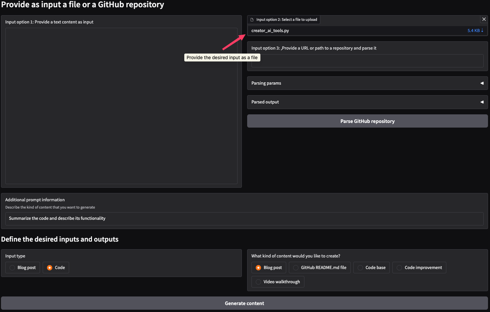

# Content Creator AI Tools

This application provides an AI-powered solution for generating different types of content, such as blog posts, README files, code improvements, and video walkthroughs, based on provided inputs. It can process either local files or GitHub repositories to serve as context for content generation. The purpose of this tool is to streamline the content creation process using the power of AI models.

The current iteration of this applicaiton leverages Gemini through the [Google AI studio](https://aistudio.google.com/) API to generate content.

**Supported input types**
- Blog post
- Code

**Supported output types**
- Blog post
- GitHub README.md file
- Code base
- Code improvement
- Video walkthrough

## How it works


The application provides a user-friendly interface built with Gradio. You can input a file or a repository path, specify the input and output content types, and provide additional instructions. The application then uses the Gemini AI model to generate the desired content.

1. Select the type of the input content in the "Input type" dropdown.
2. Choose the desired output content type from the "What kind of content would you like to create?" dropdown.
3. Provide an input of one of the supported options below.
    1. Providing a GitHub Repository: Enter the URL or local path of a Git repository in the "Provide a URL or path to a local repository" textbox.
    2. Providing a Text: Enter a text at the "Provide a text content as input" textbox.
    3. Providing a File: Upload a single file using the "Select a file to upload" section.
4. If a repository is provided, optionally add parameters on how to parse the repository.
5. If a repository is provided, the application parses the repository structure, summarize its contents, and extract individual file contents.
6. Optionally, add specific instructions or context in the "Additional prompt information" field.
7. Click the "Generate content" button.
8. The generated content will be displayed in the "Generated content" textbox.
9. You can further refine the generated content by adding instructions in the "Keep iterate over the content" field and clicking "Iterate over the content".

## Setup

### Prerequisites

-  A [Google AI studio](https://aistudio.google.com/) API key (set as `GEMINI_API_KEY` in your environment variables)

1. **Clone the repository:**
```bash
git clone https://github.com/dimitreOliveira/content_creator-ai_tools.git
cd content_creator-ai_tools
```

2. **Create a virtual environment (recommended):**
```bash
python -m venv content_creator_ai_tools
source content_creator_ai_tools/bin/activate  # On Linux/macOS
content_creator_ai_tools\Scripts\activate  # On Windows
```

3. **Install the dependencies:**
```bash
make build
```
Alternatively, you can use `pip`:
```bash
pip install -r requirements.txt
```

4. **Set up the Gemini API key:**
-   Obtain an API key from [Google AI studio](https://aistudio.google.com/).
-   Set the `GEMINI_API_KEY` environment variable with your API key. You can do this by adding the following line to your `.bashrc`, `.zshrc`, or similar shell configuration file:
```bash
export GEMINI_API_KEY="YOUR_API_KEY"
```
Or, you can create a `.env` file in the root directory with the following content (recommended):
```
GEMINI_API_KEY=YOUR_API_KEY
```
If using a .env file, ensure you have python-dotenv installed (it should be if you ran make build).

## Usage (Makefile Commands)

The Makefile provides convenient commands for common tasks:

- Runs the Gradio application, then you can access in your web browser.
```bash
make app
```

- Installs the required dependencies to run the app.
```bash
make build
```

- Runs linting and formatting tools (isort, black, flake8, mypy) to ensure code quality and consistency.
```bash
make lint
```

## Examples

### Example 1: Generating a Blog Post from a Code Script
1.  Select "Code" as the input type.
2.  Select "Blog post" as the output type.
3.  Upload a Python script containing code.
4.  Provide additional instructions such as "Summarize the code and describe its functionality" in the prompt section.
5.  Click on "Generate content".



### Example 2: Creating a README from a GitHub Repository
1.  Select "Code base" as the input type.
2.  Select "GitHub README.md file" as the output type.
3.  Enter the URL or local path of the GitHub repository to parse.
4.  Click on "Parse GitHub repository" to fetch repository summary, tree structure, and file content.
5.  Provide additional instructions such as "Explain how to set up the environment and run the app" in the prompt section.
6.  Click on "Generate content".


### Example 3: Creating a Video Walkthrough from a Blog Post
1.  Select "Blog post" as the input type.
2.  Select "Video walkthrough" as the output type.
3.  Input the blog post into the "Input text field".
4.  Provide additional instructions such as "The video walkthrough must be engaging and suited for short content" in the prompt section.
5.  Click on "Generate content".


## App workflow

1. The user provides input, either a file or a repository path.
2. If a repository path is provided, the application uses the `repository_parser.py` to parse the repository structure and content.
3. The user selects the input and output content types and provides any additional instructions.
4. The application constructs a prompt based on the input, selected types, and additional instructions.
5. The prompt is sent to the Google Gemini API via the `gemini_client.py`.
6. The Gemini API generates the content based on the prompt.
7. The generated content is displayed to the user.
8. The user can iterate on the generated content by providing further instructions.


<!-- ### Interface Elements
*   **File Input:** Allows users to upload a file that serves as the basis for the content generation.
*   **Repository Path:** Allows users to input a path to a repository to parse.
*   **Parsing Parameters:**
    *   **Max File Size:** Filters out any files bigger than this size, in MB.
    *   **Include Patterns:** Includes files matching these patterns (e.g.: `README.md, src/, *.py`).
    *   **Exclude Patterns:** Excludes files matching these patterns (e.g.: `LICENSE, assets/, *.toml, .*`).
*   **Parsed Output:**
    *   **Summary:** Text summary of the parsed repository
    *   **Tree:** Directory structure of the repository.
    *   **Content:** Content of all files in the repository.
*   **Input Type:** Specifies the type of content to process: "Blog post" or "Code".
*   **Output Type:** Specifies the type of content to generate: "Blog post," "GitHub README.md file", "Code base", "Code improvement," or "Video walkthrough."
*   **Additional Prompt Information:** Provides a space for users to provide further instructions for the content generation.
*   **Generated Content:** Output of the AI content generation.
*   **Iterate over the content:** Option to perform additional iterations over the created content. -->

## Configs

The application's behavior can be configured using the `configs.yaml` file.

```yaml
ai_studio:
  model_id: gemini-2.0-flash-exp
  generation_config:
    temperature: 1
    top_p: 0.95
    top_k: 40
    max_output_tokens: 8192
```
- **ai_studio:** Contains configurations specific to the AI Studio/Gemini client.
    - **model_id:** Specifies the Gemini model to be used (e.g., gemini-2.0-flash-exp).
    - **generation_config:** Parameters to control the content generation process.
        - **temperature:** Controls the randomness of the output. Higher values (e.g., 1) make the output more random, while lower values (e.g., 0) make it more deterministic.
        - **top_p:** Nucleus sampling. Considers the smallest set of most probable tokens whose probabilities sum to at least top_p.
        - **top_k:** Considers the top_k most likely tokens.
        - **max_output_tokens:** The maximum number of tokens the model can generate in the output.

## Contributing

Contributions to this project are welcome! Feel free to fork the repository, make changes, and submit a pull request. Before submitting, please ensure your code passes the linting checks by running:
```bash
make lint
```

## Disclaimers

- This application utilizes external APIs (like Google Gemini) which may have their own terms of service and usage limitations.
- The quality of the generated content depends on the input provided and the capabilities of the underlying AI model.
- Ensure you have the necessary permissions and comply with the terms of service for the underlying AI model.
- The application is for informational and creative purposes. Always review and verify the generated content before using it.